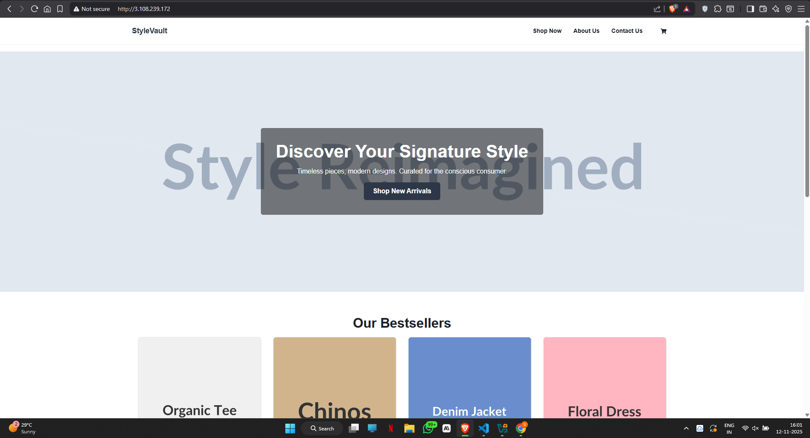
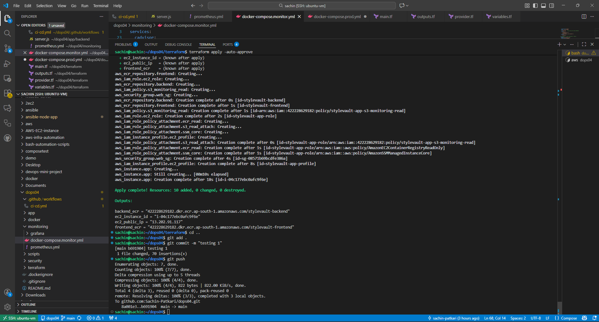
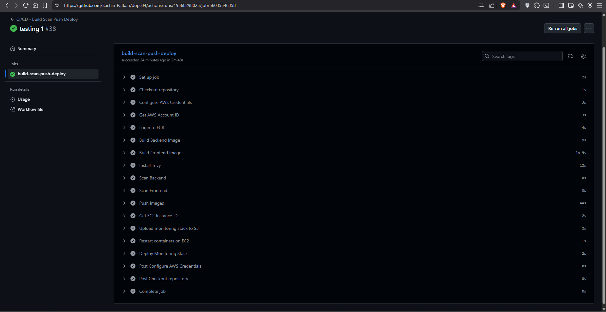
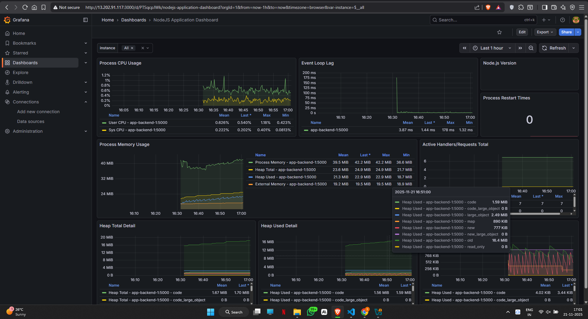
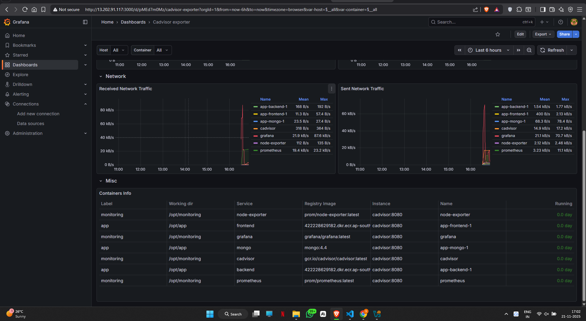
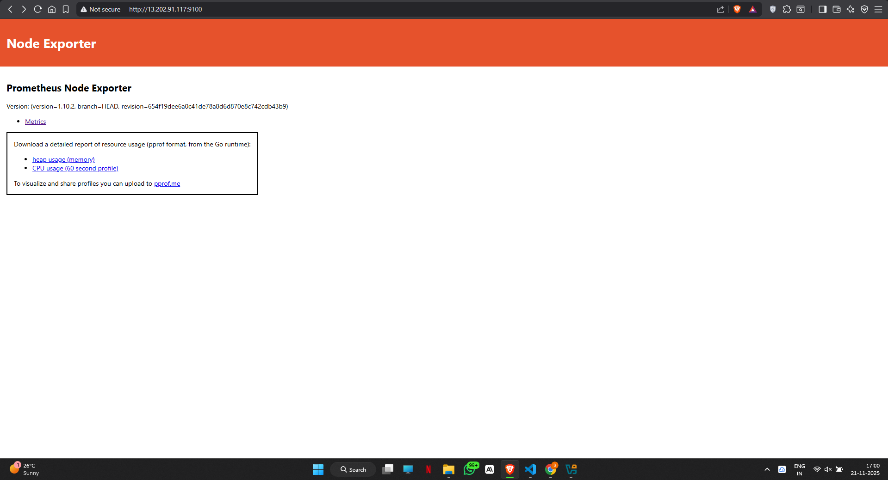
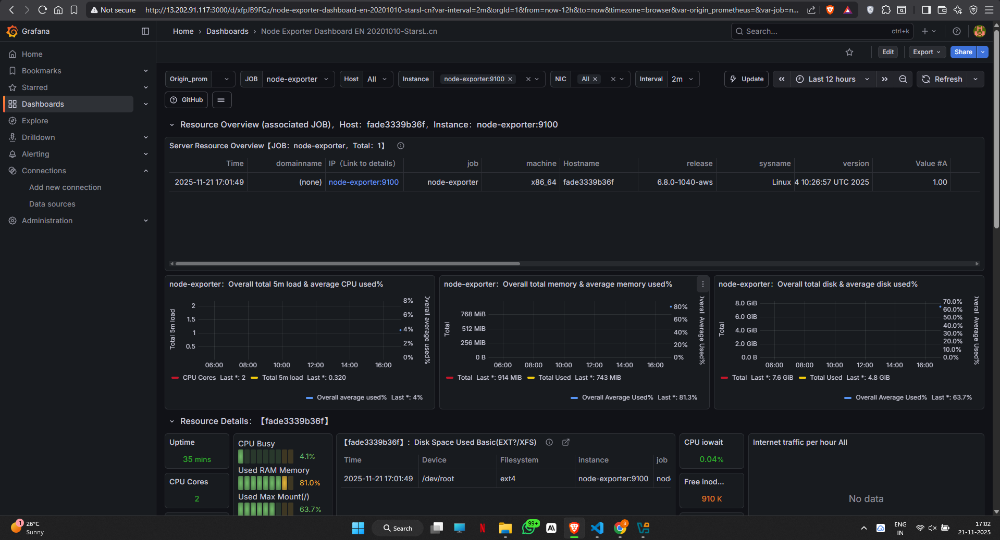
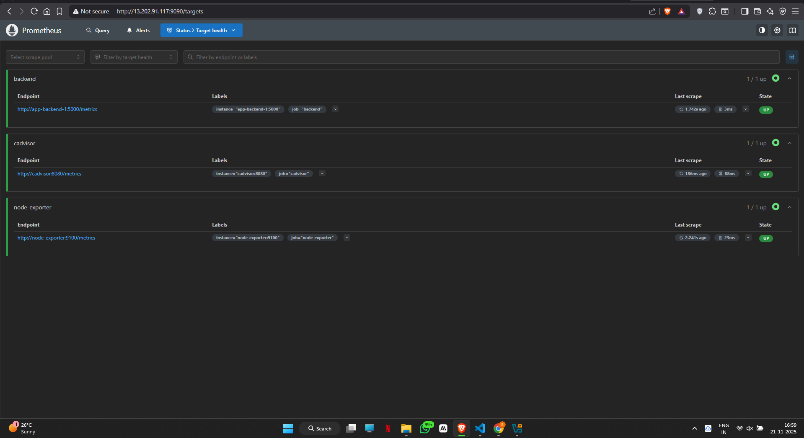

# 🚀 StyleVault - Production-Ready DevOps Pipeline

<div align="center">


**Complete end-to-end DevOps implementation featuring automated infrastructure provisioning, containerized deployment, and comprehensive monitoring**

[Features](#-features) • [Architecture](#-architecture) • [Quick Start](#-quick-start) • [Documentation](#-documentation)

</div>

---

## 📋 Overview

StyleVault is a production-grade DevOps project showcasing a fully automated deployment pipeline for a 3-tier full-stack application (React + Node.js + MongoDB). The project demonstrates enterprise-level practices including Infrastructure as Code, CI/CD automation, container orchestration, and complete observability.

### 🎯 Key Highlights

- **Zero-SSH Deployment** - Secure deployments via AWS Systems Manager
- **Full Automation** - From infrastructure provisioning to application deployment
- **Production-Ready** - Security scanning, monitoring, and reverse proxy configuration
- **Cloud-Native** - Leverages AWS services with OIDC authentication
- **Observable** - Complete metrics stack with custom dashboards

---

## ✨ Features

### Infrastructure & Security
- 🏗️ **Terraform IaC** - Automated AWS resource provisioning
- 🔐 **GitHub OIDC** - Keyless authentication for CI/CD
- 🛡️ **Security Scanning** - Trivy vulnerability detection in pipeline
- 🔒 **IAM Best Practices** - Least-privilege access policies

### Application Stack
- ⚛️ **React Frontend** - Modern SPA with Nginx reverse proxy
- 🟢 **Node.js Backend** - Express API with Prometheus metrics endpoint
- 🍃 **MongoDB** - Containerized database with persistent volumes
- 🐳 **Docker Compose** - Multi-container orchestration

### CI/CD & Deployment
- ⚡ **GitHub Actions** - Automated build, test, and deploy pipeline
- 📦 **Amazon ECR** - Private container registry
- 🚀 **AWS SSM** - Agentless deployment mechanism
- 🔄 **Rolling Updates** - Zero-downtime container updates

### Monitoring & Observability
- 📊 **Prometheus** - Metrics collection and storage
- 📈 **Grafana** - Visual dashboards and alerting
- 🖥️ **Node Exporter** - Host-level metrics (CPU, RAM, Disk)
- 🐋 **cAdvisor** - Container resource metrics

---

## 🏗️ Architecture

```
┌─────────────────────────────────────────────────────────────┐
│                        GitHub Actions                        │
│  (Build → Scan → Push to ECR → Deploy via SSM)              │
└──────────────────────┬──────────────────────────────────────┘
                       │
                       ▼
┌─────────────────────────────────────────────────────────────┐
│                      AWS Cloud (Terraform)                   │
│                                                              │
│  ┌──────────────────────────────────────────────────────┐  │
│  │                    EC2 Instance                       │  │
│  │  ┌────────────────────────────────────────────────┐  │  │
│  │  │           Docker Compose Stack                 │  │  │
│  │  │                                                 │  │  │
│  │  │  ┌─────────┐  ┌─────────┐  ┌──────────────┐  │  │  │
│  │  │  │ React   │  │ Node.js │  │   MongoDB    │  │  │  │
│  │  │  │ Frontend│◄─┤ Backend │◄─┤   Database   │  │  │  │
│  │  │  │ (Nginx) │  │ + prom  │  │              │  │  │  │
│  │  │  └────┬────┘  └────┬────┘  └──────────────┘  │  │  │
│  │  │       │            │                          │  │  │
│  │  │       │            └────────┐                 │  │  │
│  │  │       │                     ▼                 │  │  │
│  │  │       │          ┌────────────────────┐      │  │  │
│  │  │       │          │   Prometheus       │      │  │  │
│  │  │       │          │   + Grafana        │      │  │  │
│  │  │       │          │   + Node Exporter  │      │  │  │
│  │  │       │          │   + cAdvisor       │      │  │  │
│  │  │       │          └────────────────────┘      │  │  │
│  │  └───────┼──────────────────────────────────────┘  │  │
│  │          │                                          │  │
│  └──────────┼──────────────────────────────────────────┘  │
│             │                                              │
│  ┌──────────▼─────────┐  ┌──────────────┐                │
│  │ Security Group     │  │     ECR      │                │
│  │ (Ports: 80, 5001,  │  │ Repositories │                │
│  │  9090, 3000, etc.) │  └──────────────┘                │
│  └────────────────────┘                                   │
└─────────────────────────────────────────────────────────────┘
```

---

## 📁 Project Structure

```
stylevault/
├── app/
│   ├── backend/              # Node.js Express API
│   │   ├── src/
│   │   ├── package.json
│   │   └── Dockerfile
│   └── frontend/             # React application
│       ├── src/
│       ├── package.json
│       └── Dockerfile
│
├── terraform/                # Infrastructure as Code
│   ├── main.tf               # Core infrastructure
│   ├── variables.tf          # Input variables
│   ├── outputs.tf            # Output values
│   ├── provider.tf           # AWS provider config
│   └── github_trust_policy.json
│
├── docker/
│   └── docker-compose.prod.yml    # Production stack
│
├── monitoring/
│   ├── docker-compose.monitor.yml # Monitoring stack
│   ├── prometheus.yml             # Prometheus config
│   └── grafana/
│       └── dashboards/            # Pre-built dashboards
│
├── .github/
│   └── workflows/
│       └── ci-cd.yml         # GitHub Actions pipeline
│
└── README.md
```

---

## 🚀 Quick Start

### Prerequisites

- AWS Account with appropriate permissions
- Terraform >= 1.0
- GitHub repository with Actions enabled
- AWS CLI configured locally

### 1️⃣ Clone the Repository

```bash
git clone https://github.com/Sachin-Patkari/dops04
cd dops04
```

### 2️⃣ Configure AWS Credentials

```bash
aws configure
```

### 3️⃣ Deploy Infrastructure

```bash
cd terraform
terraform init
terraform apply
```

**Terraform will create:**
- EC2 instance with Docker pre-installed
- ECR repositories for frontend and backend
- IAM roles and security groups
- OIDC provider for GitHub Actions
- S3 bucket for monitoring configs

### 4️⃣ Configure GitHub Secrets

Add the following secrets to your GitHub repository:

```
AWS_ACCOUNT_ID          # Your AWS account ID
AWS_REGION              # AWS region (e.g., us-east-1)
ECR_REPOSITORY_BACKEND  # Backend ECR repo name
ECR_REPOSITORY_FRONTEND # Frontend ECR repo name
OIDC_ROLE_ARN          # From Terraform output
EC2_INSTANCE_ID        # From Terraform output
```

### 5️⃣ Trigger Deployment

```bash
git add .
git commit -m "Initial deployment"
git push origin main
```

GitHub Actions will automatically:
1. Build Docker images
2. Scan for vulnerabilities
3. Push to ECR
4. Deploy to EC2 via SSM
5. Start monitoring stack

---

**This is how the application will look like .**
---
Application UI:




## 📊 Accessing Services

After successful deployment, access your services:

| Service | URL | Description |
|---------|-----|-------------|
| **Frontend** | `http://<ec2-ip>:80` | React application |
| **Backend API** | `http://<ec2-ip>:5001/api` | Node.js API |
| **Prometheus** | `http://<ec2-ip>:9090` | Metrics database |
| **Grafana** | `http://<ec2-ip>:3000` | Dashboards (admin/admin) |
| **Node Exporter** | `http://<ec2-ip>:9100/metrics` | Host metrics |
| **cAdvisor** | `http://<ec2-ip>:8081` | Container metrics |

---

## 🔧 Local Development

### Run Backend Locally

```bash
cd app/backend
npm install
npm run dev
```

### Run Frontend Locally

```bash
cd app/frontend
npm install
npm start
```

### Run Full Stack with Docker

```bash
docker compose -f docker/docker-compose.prod.yml up --build
```

---

## 📖 Documentation

### Infrastructure Details


<summary><b>Terraform Resources</b></summary>

- **EC2 Instance**: Ubuntu 22.04 with automated Docker setup
- **IAM Role**: Allows ECR access and SSM management
- **Security Group**: Configured ports for app and monitoring
- **ECR Repositories**: Private registries for container images
- **OIDC Provider**: GitHub Actions authentication
- **S3 Bucket**: Monitoring configuration storage

**Screenshot:**



<summary><b>Security Group Rules</b></summary>

| Port | Service | Access |
|------|---------|--------|
| 80 | Frontend | Public |
| 5001 | Backend API | Public |
| 9090 | Prometheus | Public* |
| 3000 | Grafana | Public* |
| 9100 | Node Exporter | Internal |
| 8081 | cAdvisor | Internal |
| 27017 | MongoDB | Container Network |

*Should be restricted to specific IPs in production


### CI/CD Pipeline

<summary><b>Pipeline Stages</b></summary>

1. **Authentication**: OIDC login to AWS (keyless)
2. **Build**: Create Docker images for frontend and backend
3. **Security Scan**: Trivy vulnerability scanning (fail on CRITICAL/HIGH)
4. **Push**: Upload images to ECR with `latest` tag
5. **Deploy Application**: SSM command to pull and restart containers
6. **Deploy Monitoring**: Start Prometheus, Grafana, exporters

**Screenshot:**



### Monitoring Stack

<summary><b>Metrics Collection</b></summary>

**Prometheus Targets:**
- Node Exporter (EC2 host metrics)
- cAdvisor (Docker container metrics)
- Backend `/metrics` endpoint (application metrics)

**Available Metrics:**
- CPU, Memory, Disk usage (host)
- Container resource utilization
- HTTP request rates and latency
- Custom application metrics

**Screenshot:**



**Screenshot:**



**Screenshot:**



**Screenshot:**



---

## 🛠️ Configurations

### Environment Variables

Backend supports the following environment variables:

```env
MONGODB_URI=mongodb://mongo:27017/stylevault
PORT=5000
NODE_ENV=production
```

### Prometheus Configuration

Located in `monitoring/prometheus.yml`:

```yaml
scrape_configs:
  - job_name: 'backend'
    static_configs:
      - targets: ['backend:5000']
  - job_name: 'node-exporter'
    static_configs:
      - targets: ['node-exporter:9100']
  - job_name: 'cadvisor'
    static_configs:
      - targets: ['cadvisor:8080']
```


**Screenshot:**



---

## 🔒 Security Best Practices

- ✅ No hardcoded credentials
- ✅ OIDC authentication (no AWS keys in GitHub)
- ✅ Vulnerability scanning in CI/CD
- ✅ Least-privilege IAM policies
- ✅ Security group restrictions
- ✅ Container image scanning
- ⚠️ **TODO**: Enable HTTPS with SSL certificates
- ⚠️ **TODO**: Restrict monitoring ports to VPN/bastion

---

## 🐛 Troubleshooting

<details>
<summary><b>Containers not starting</b></summary>

```bash
# SSH into EC2 (if needed) or use Session Manager
aws ssm start-session --target <instance-id>

# Check container status
docker ps -a

# View logs
docker logs <container-name>
```

</details>

<details>
<summary><b>CI/CD pipeline failing</b></summary>

1. Verify GitHub secrets are set correctly
2. Check IAM permissions for OIDC role
3. Ensure ECR repositories exist
4. Review GitHub Actions logs for specific errors

</details>

<details>
<summary><b>Monitoring not showing data</b></summary>

```bash
# Check if monitoring containers are running
docker ps | grep -E 'prometheus|grafana|node-exporter|cadvisor'

# Restart monitoring stack
cd /opt/monitoring
docker-compose -f docker-compose.monitor.yml restart
```

</details>

---

## 🎯 Technology Stack

| Category | Technologies |
|----------|-------------|
| **Frontend** | React, Nginx |
| **Backend** | Node.js, Express, prom-client |
| **Database** | MongoDB |
| **Infrastructure** | Terraform, AWS (EC2, ECR, IAM, SSM, S3) |
| **Containers** | Docker, Docker Compose |
| **CI/CD** | GitHub Actions |
| **Monitoring** | Prometheus, Grafana, Node Exporter, cAdvisor |
| **Security** | Trivy, AWS IAM, OIDC |


---

## 👤 Author

- GitHub: [@Sachin-Patkari](https://github.com/Sachin-Patkari)

---
